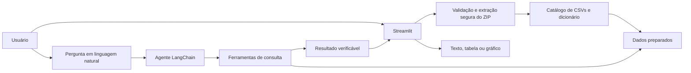

# Arquitetura inicial

## Princípio

Começar com um único agente funcional e componentes pequenos. A arquitetura pode evoluir para agentes especializados somente quando isso resolver uma necessidade observada.

## Fluxo proposto

## Responsabilidades

### ui

Recebe o ZIP, informa o estado do processamento, coleta perguntas e renderiza respostas. Não contém regras de consulta.

### processing

Valida extensão e tamanho, extrai o ZIP com segurança, localiza CSVs e dicionário, normaliza formatos e cria um catálogo de dados para a sessão.

### agents

Interpreta a intenção, escolhe uma ferramenta permitida e formula a resposta a partir do resultado retornado. Não deve inventar números nem executar código arbitrário fornecido pelo usuário.

### tools

Executa operações determinísticas e testáveis, como seleção, filtro, agrupamento, soma, contagem, ranking e preparação de séries para gráficos.

## Fluxo de erro

Falhas de upload, ZIP inseguro, CSV ilegível, ausência de dicionário, pergunta inválida e indisponibilidade do modelo devem gerar mensagens claras, sem revelar credenciais ou detalhes sensíveis.

## Estado e dados

O MVP pode manter os DataFrames na sessão para privilegiar simplicidade. Dados carregados e resultados gerados não devem ser versionados. Uma camada persistente só será introduzida se houver necessidade comprovada.
