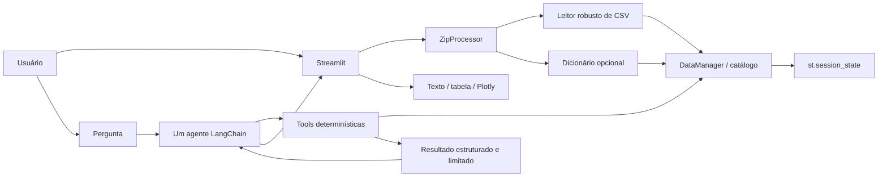

# Arquitetura do MVP

## Objetivo arquitetural

Entregar o menor fluxo capaz de interpretar perguntas em linguagem natural e respondê-las de forma verificável sobre CSVs fornecidos pelo usuário. A aplicação usa um único agente como orquestrador; leitura, filtros e cálculos permanecem em componentes pandas determinísticos.

Não fazem parte deste MVP: multi-agent, execução de código gerado, SQL livre, RAG, banco vetorial, banco relacional, API separada, frontend separado ou persistência de dados.

## Fluxo



## Componentes

### Configuração

As variáveis de ambiente são carregadas de forma centralizada com `python-dotenv`:

- `GROQ_API_KEY`: credencial local obrigatória apenas para consultar o modelo;
- `GROQ_MODEL`: modelo, com padrão `llama-3.3-70b-versatile`;
- `APP_MAX_UPLOAD_MB`: limite do upload, com padrão de 500 MB;
- `LOG_LEVEL`: nível de log, com padrão `INFO`.

A ausência da chave não impede a inspeção do projeto nem deve produzir traceback bruto na interface. Ela impede somente a etapa que precisa da Groq e gera orientação clara ao usuário.

### Interface `ui`

A mesma aplicação Streamlit apresenta duas áreas:

1. **Carga**: recebe o objeto enviado por `st.file_uploader`, mostra o processamento e resume arquivos, dimensões, encoding, separador e dicionário.
2. **Consulta**: habilitada apenas após ao menos um dataset válido, usa `st.chat_message` e `st.chat_input` e mantém o histórico em `st.session_state`.

Uma resposta pode conter texto e um resultado estruturado. Tabelas são renderizadas quando ajudam a conferir os dados; gráfico de barras é usado em rankings/categorias e linha em séries temporais. Não há gráfico meramente decorativo.

### Processamento do ZIP

O processador recebe bytes ou um objeto de upload, sem exigir caminho local e sem usar `extractall`:

- confirma que a entrada é um ZIP válido, não apenas que termina em `.zip`;
- aplica o limite configurado e verifica os tamanhos declarados das entradas;
- limita o conjunto de dicionários a 25 MB para evitar materialização excessiva;
- normaliza e valida cada nome, rejeitando caminho absoluto, `..` e outras formas de Zip Slip;
- aceita CSVs dentro de subdiretórios;
- exige ao menos um CSV legível;
- procura dicionário JSON ou CSV por nomes reconhecíveis;
- abre cada entrada diretamente do arquivo compactado.

Se nenhum dicionário for localizado, a carga continua e informa exatamente: **“Dicionário de dados não identificado no pacote.”**

### Leitura de CSV

O leitor tenta combinações pequenas e conhecidas:

- encodings: `utf-8-sig`, `utf-8`, `cp1252` e `latin-1`;
- separadores: `,` e `;`;
- decimais: `.` e `,`.

A escolha não se baseia apenas em uma leitura sem exceção. Candidatos de uma única coluna são penalizados quando o conteúdo indica outro delimitador, e o resultado precisa ter estrutura consistente. Os metadados registram encoding, separador, decimal quando disponível, número de linhas e número de colunas.

Datas e números podem ganhar representações normalizadas quando a conversão for segura. Identificadores, valores ambíguos e a coluna original não devem ser destruídos por conversão especulativa.

### `DataManager` e catálogo

O `DataManager`, promovido conceitualmente da prova de conceito de Leonardo Vilela, mantém os DataFrames e metadados apenas na sessão. Para cada dataset, o catálogo oferece:

- nome;
- número de linhas e colunas;
- lista de colunas e `dtypes`;
- quantidade de nulos por coluna;
- encoding, separador e decimal identificados;
- descrição do dataset e das colunas quando houver dicionário.

O objeto é armazenado em `st.session_state`; recarregar ou encerrar a sessão descarta os dados. Não há banco nem escrita dos uploads no repositório.

Cabeçalho e itens compartilham `CHAVE DE ACESSO`, mas as perguntas de aceitação usam colunas já presentes em cada arquivo e não exigem join. Se uma consulta futura realmente precisar da relação, ela deverá ganhar uma operação explícita, determinística e testada; o agente não inventa joins nem escreve pandas arbitrário.

### Tools

As tools encapsulam operações pandas permitidas:

| Tool | Responsabilidade |
|---|---|
| `list_datasets` | listar datasets e metadados essenciais |
| `describe_dataset` | retornar schema, tipos, nulos e descrições disponíveis |
| `aggregate_data` | `sum`, `mean`, `count`, `min` ou `max`, com agrupamento opcional |
| `top_n` | maiores ou menores grupos, com agregação e N limitado |
| `filter_data` | filtros simples por operadores autorizados e poucas linhas |
| `unique_values` | valores distintos com limite |
| `time_aggregation` | agregação por ano, mês ou ano-mês |

As tools validam dataset, coluna, operação, tipo e limites. Tabelas retornam no máximo 50 linhas, filtros expõem no máximo 12 colunas e textos individuais são truncados a 500 caracteres no contrato enviado ao agente. Elas nunca chamam `eval`, `exec`, shell, SQL arbitrário ou código produzido pelo modelo.

### Resultado estruturado

As tools retornam objetos serializáveis e limitados, com campos equivalentes a:

```text
result_type: scalar | table | series | error
summary: resumo curto
columns: nomes das colunas retornadas
rows: registros limitados
chart_hint: none | bar | line
metadata: operação, dataset e detalhes úteis
```

O resultado completo pode alimentar tabela ou gráfico na UI. O agente recebe apenas o resumo e as linhas necessárias para formular a resposta, nunca milhares de registros.

### Agente

O único agente é criado com a API `create_agent` do LangChain 1.x e usa `ChatGroq` com temperatura zero. Seu papel é identificar a intenção, escolher uma tool, fornecer argumentos válidos e redigir uma resposta baseada no retorno.

Antes da chamada ao modelo, um resolvedor semântico conservador consulta os
nomes e as descrições do catálogo. Para intenções inequívocas, ele produz um
plano sem ler registros ou calcular resultados: tool, dataset, agrupamento,
medida e agregação. Esse plano diferencia emitente de destinatário, `SUM` de
quantidade de `COUNT` de registros e granularidade de cabeçalho da granularidade
de item. O agente recebe somente os identificadores escolhidos, sem incorporar
texto bruto do dicionário ao prompt, e uma validação pós-tool bloqueia respostas
cuja evidência não corresponda ao plano.

Sem dicionário, o resolvedor usa somente nomes convencionais do schema. Se os
nomes forem opacos, houver empate entre datasets ou a pergunta exigir dimensão
temporal e categórica não suportada pela mesma tool, nenhum plano é imposto e o
agente deve esclarecer a intenção em vez de degradar silenciosamente a consulta.

O schema de `top_n` admite inteiro ou string para `n`; a tool converte strings
numéricas para inteiro e rejeita valores vazios, não numéricos ou não positivos.
Essa tolerância existe no contrato enviado à Groq, pois a validação externa
ocorre antes do pandas. Quando uma intenção requer duas dimensões, como
fornecedor e cliente por valor, o resolvedor gera dois planos, o agente exige uma
evidência por plano e a UI armazena/renderiza ambas.

O prompt obriga o agente a:

- responder somente sobre os datasets carregados;
- obter toda afirmação numérica por tool;
- não substituir uma tool por cálculo mental;
- não inventar colunas, números, significados ou causalidade;
- não converter ranking financeiro em julgamento qualitativo;
- usar o dicionário quando disponível;
- respeitar a resolução semântica de dataset, coluna e operação;
- apontar coluna ausente ou dados insuficientes;
- pedir esclarecimento quando interpretações diferentes alterarem materialmente a resposta;
- recusar fatos externos ao escopo dos dados;
- não revelar credenciais nem executar código do usuário.

Schema, metadados, resultados das tools e, somente quando indispensável, amostras pequenas formam o contexto. Os DataFrames completos nunca são enviados ao modelo.

## Erros e observabilidade

Erros esperados são convertidos em mensagens de domínio: upload grande, arquivo não ZIP, ZIP inseguro, pacote sem CSV, CSV ilegível, coluna inexistente, filtro inválido, pergunta fora do escopo e falha da Groq. Logs conservam informação técnica útil sem registrar chave ou conteúdo tabular completo; a interface não exibe traceback bruto.

## Limites do desenho

- Dados descompactados ficam em memória e o consumo cresce com o volume e os tipos inferidos pelo pandas.
- A qualidade da interpretação em linguagem natural depende do modelo externo, embora os cálculos sejam locais.
- O conjunto de operações é deliberadamente restrito; perguntas que exijam transformação nova precisam de uma tool explícita.
- Inferência de formato e de tipo é heurística, portanto os metadados exibidos devem ser conferidos em arquivos incomuns.
- O dicionário melhora a semântica, mas sua ausência não pode ser compensada com significados inventados pelo agente.

O dataset 202401 é o cenário principal de desenvolvimento. O dataset 202505 é a validação adicional de volume, CP1252, `;` e decimal brasileiro; limitações observadas nessa execução devem ser registradas no relatório.
