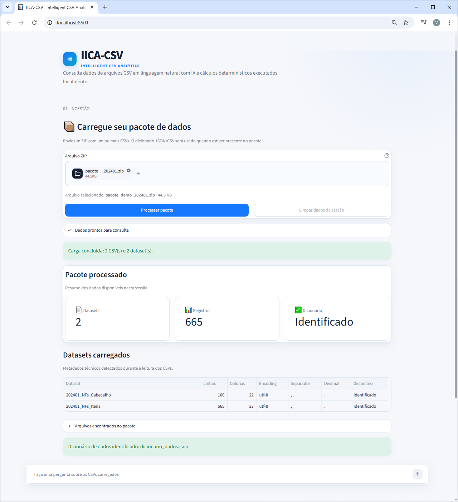
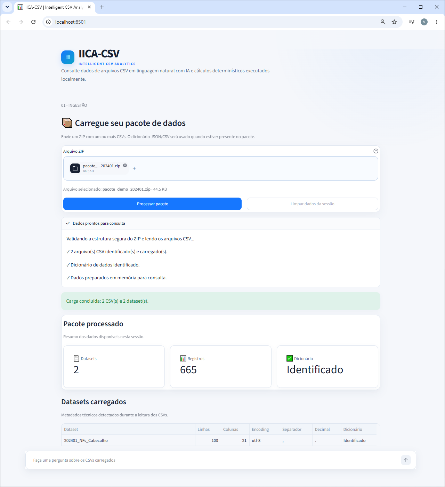
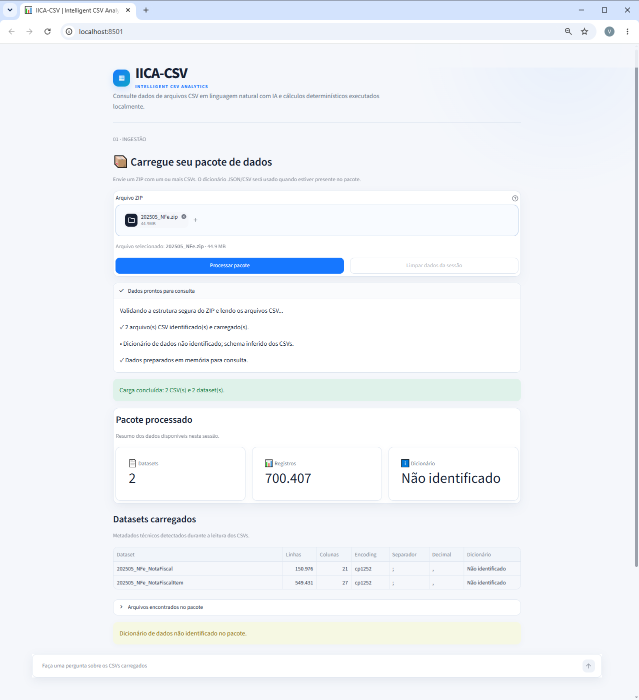
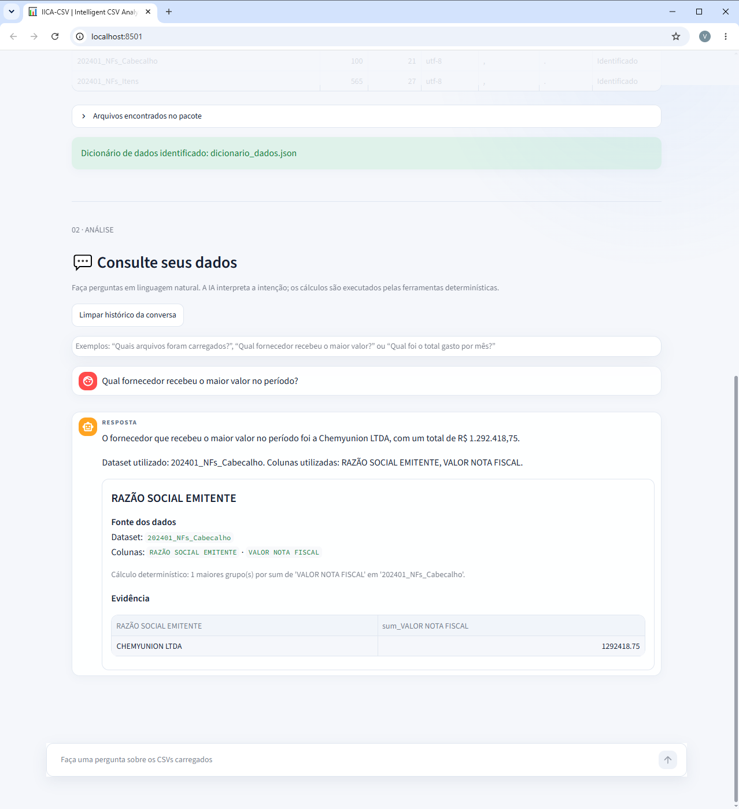
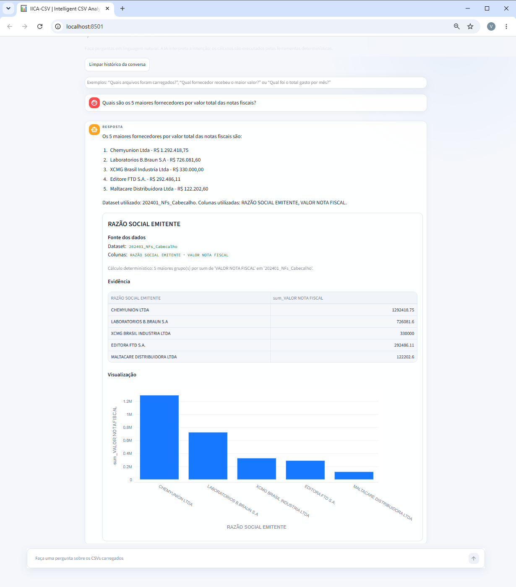
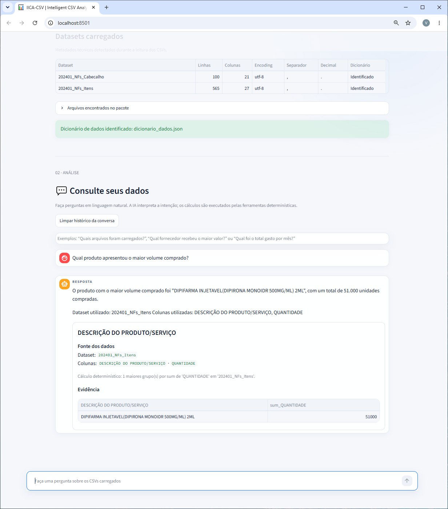
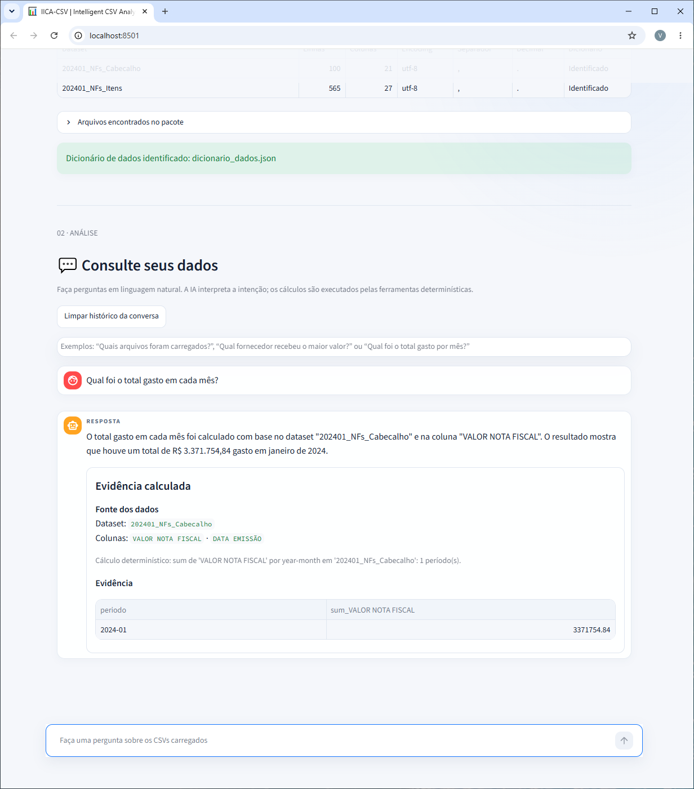
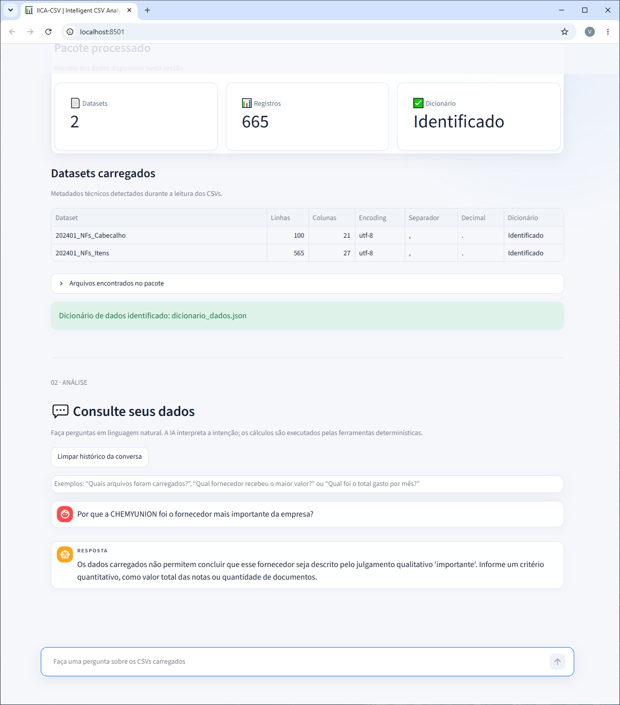
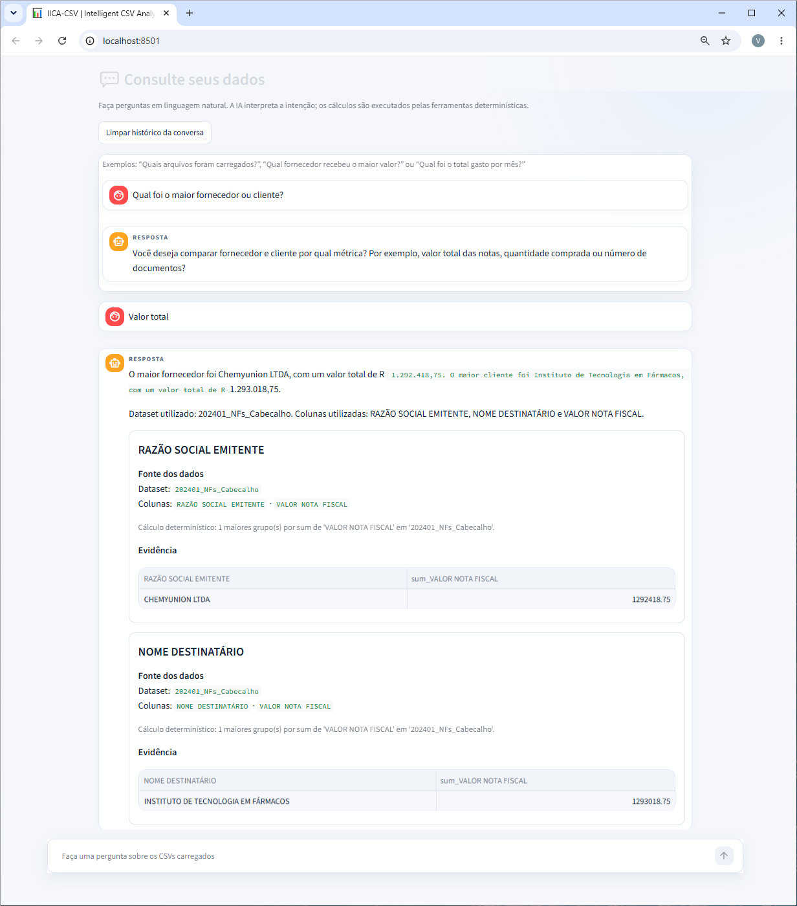

# IICA-CSV — Interface Inteligente para Consulta de Arquivos CSV

## Relatório técnico final — Desafio 4

| Identificação | Informação |
|---|---|
| Projeto | IICA-CSV — Intelligent CSV Analytics |
| Curso | Agentes Inteligentes — InsurMinds / I2A2 |
| Desafio | Desafio 4 — Interface Inteligente para Consulta de Arquivos CSV |
| Repositório | `malandrindev/IICA-CSV-desafio4` |
| Branch de validação | `feature/desafio4-mvp` |
| Versão documentada | MVP final |
| Data desta consolidação | 14/08/2026 |
| Estado do documento | Fonte Markdown final, pronta para revisão e exportação em PDF |

Este documento consolida a documentação técnica da solução com a implementação efetivamente presente em `src/iica_csv/`, os testes automatizados e as evidências visuais registradas em `screenshots/`. Exemplos conceituais e resultados provisórios foram substituídos por contratos, nomes de colunas e resultados efetivamente observados na aplicação.

## 1. Resumo executivo

O IICA-CSV é um MVP para consulta, em linguagem natural, de um pacote ZIP com um ou mais arquivos CSV. A solução possui duas interfaces integradas no Streamlit: a primeira recebe, valida e cataloga os dados; a segunda permite que o usuário faça perguntas e receba texto, fonte dos dados, evidência tabular e, quando aplicável, gráfico.

A arquitetura utiliza um único agente LangChain com `ChatGroq`. Antes da chamada ao modelo, um resolvedor semântico local usa o schema e, quando disponível, o dicionário de dados para produzir planos de consulta. O modelo atua como intérprete e orquestrador das ferramentas. Os cálculos quantitativos são executados localmente por operações pandas restritas e determinísticas; o LLM não recebe os DataFrames completos e não executa código gerado pelo usuário.

O MVP foi demonstrado com dois pacotes oficiais de perfis distintos:

- o pacote de demonstração 202401, com dois datasets, 665 registros e dicionário de dados;
- o pacote oficial 202505, com aproximadamente 44,9 MB, dois datasets e 700.407 registros em CP1252, separados por ponto e vírgula e com decimal por vírgula.

As quatro perguntas obrigatórias foram executadas na aplicação e estão documentadas neste relatório com resultados, parâmetros analíticos e capturas de tela. A suíte automatizada final registrou `155 passed`.

## 2. Objetivo e requisitos atendidos

O objetivo foi construir uma aplicação simples, demonstrável e tecnicamente defensável que permitisse:

1. enviar um ZIP diretamente pela interface;
2. localizar e ler múltiplos CSVs, inclusive em subdiretórios;
3. usar um dicionário de dados JSON ou CSV quando presente;
4. continuar funcionando quando o dicionário estiver ausente;
5. interpretar perguntas em linguagem natural;
6. executar cálculos reais sobre os dados sem delegá-los ao LLM;
7. apresentar respostas rastreáveis por dataset, colunas, operação e evidência;
8. tratar ambiguidades, erros de entrada e falhas da API com mensagens compreensíveis.

A solução mantém deliberadamente um único agente principal. Não foram introduzidos arquitetura multi-agent, RAG, banco vetorial, banco SQL, API REST separada ou execução de código arbitrário. Essa restrição reduz o número de componentes, facilita os testes e torna o fluxo mais fácil de explicar durante a avaliação.

## 3. Framework e tecnologias

| Tecnologia | Papel na solução |
|---|---|
| Python 3.11+ | linguagem e ambiente de execução |
| Streamlit | Interface A, Interface B, estado da sessão e apresentação das evidências |
| LangChain 1.x | criação e execução do agente por meio de `create_agent` |
| `langchain-groq` / `ChatGroq` | integração do agente com a API Groq |
| Groq | provedor do modelo de linguagem |
| pandas | leitura, transformação e cálculos determinísticos sobre os CSVs |
| NumPy | apoio à serialização e a operações tabulares |
| Plotly | gráficos de barras e linhas derivados dos resultados estruturados |
| `python-dotenv` | leitura local do arquivo `.env` |
| pytest | testes determinísticos e testes do agente com modelos falsos, sem chamadas reais à Groq |

O modelo é configurável pela variável `GROQ_MODEL`. O valor padrão e o modelo usado na validação funcional foram `llama-3.3-70b-versatile`. O `ChatGroq` é criado com `temperature=0`, timeout de 60 segundos e `max_retries=2`. A temperatura zero reduz a variabilidade da orquestração, mas não torna um serviço de LLM matematicamente determinístico; o determinismo dos números vem das tools pandas.

As demais configurações são centralizadas em `src/iica_csv/config.py`: `GROQ_API_KEY`, `GROQ_MODEL`, `APP_MAX_UPLOAD_MB` e `LOG_LEVEL`. A chave permanece fora do código e do repositório.

## 4. Arquitetura da solução

A carga e a consulta compartilham a mesma aplicação, mas seguem fluxos distintos. O resolvedor semântico ocorre antes da chamada ao modelo, e o resultado das tools é validado novamente após a execução.

```text
Interface A — carga

Usuário
  → Streamlit
  → ZipProcessor (validação e leitura segura)
  → CSVReader (encoding, separador, decimal e conversões conservadoras)
  → DataManager (DataFrames e catálogo em memória)
  → st.session_state

Interface B — consulta

Usuário
  → Streamlit / histórico da sessão
  → resolvedor semântico local
       ├─ pergunta inequívoca: SemanticQueryPlan(s)
       └─ pergunta ambígua: PendingClarification
  → CSVAgent
  → create_agent + ChatGroq
  → tools determinísticas
  → pandas
  → ToolResult(s) estruturados e limitados
  → validação pós-tool contra o(s) plano(s)
  → resposta textual + fonte + tabela + gráfico quando aplicável
```

O notebook `workspaces/leo-vilelela/csv_agent_notebook.ipynb` permanece preservado como registro da prova de conceito. Conceitos validados nessa PoC, como catálogo de DataFrames, múltiplos CSVs, tools, histórico e visualização, foram promovidos para módulos oficiais em `src/iica_csv/`.

## 5. Componentes principais

### 5.1 Configuração

`src/iica_csv/config.py` define o contrato imutável `Settings` e carrega as variáveis do ambiente. Se a chave Groq não estiver configurada, a interface mantém os dados carregados visíveis, desabilita a entrada de consulta e orienta o usuário a preencher o `.env`, sem apresentar traceback bruto.

### 5.2 Processamento do pacote

`src/iica_csv/processing/zip_processor.py` contém `ZipProcessor` e o contrato `ProcessedPackage`. O processador aceita bytes, caminho ou o objeto enviado pelo Streamlit. Ele identifica os CSVs e candidatos a dicionário, associa descrições aos datasets e registra tudo em um `DataManager`.

O ZIP não é extraído para o sistema de arquivos. Cada entrada necessária é aberta diretamente com `ZipFile.open`, depois de validada.

### 5.3 Leitura dos CSVs

`src/iica_csv/processing/csv_reader.py` trabalha com um conjunto controlado de formatos:

| Propriedade | Valores suportados |
|---|---|
| Encoding | `utf-8-sig`, `utf-8`, `cp1252`, `latin-1` |
| Separador | vírgula (`,`) e ponto e vírgula (`;`) |
| Decimal | ponto (`.`) e vírgula (`,`) |

O leitor examina uma amostra para priorizar encodings, pontua a consistência dos separadores e identifica a convenção decimal. O CSV é inicialmente lido como texto. Em seguida, valores vazios são normalizados e somente colunas reconhecidas de forma segura como numéricas ou temporais são convertidas. Identificadores são preservados como texto, e uma conversão não substitui a coluna quando nem todos os valores presentes podem ser interpretados com segurança.

Uma leitura que produza somente uma coluna é rejeitada, pois normalmente indica escolha incorreta do delimitador.

### 5.4 Catálogo em memória

`src/iica_csv/processing/data_manager.py` implementa `DataManager`. Cada dataset mantém:

- nome lógico e nome do arquivo de origem;
- quantidade de linhas e colunas;
- lista de colunas e tipos pandas;
- quantidade de nulos por coluna;
- encoding, separador e decimal detectados;
- nó relacionado do dicionário;
- descrição do dataset e descrições de colunas, quando disponíveis.

Os DataFrames ficam em memória durante a sessão Streamlit. Não há banco, persistência entre sessões ou estado global criado pelo `DataManager`.

### 5.5 Resolvedor semântico

`src/iica_csv/agents/semantic_resolver.py` não contém um segundo agente. É uma camada local composta por funções e dataclasses, entre elas `SemanticQueryPlan`, `SemanticResolution` e `PendingClarification`.

O resolvedor avalia nomes dos datasets, nomes das colunas e descrições do dicionário, sem ler registros para escolher uma coluna. Ele distingue, entre outros papéis:

- fornecedor, supplier, emitente ou vendedor → nome/razão social do emitente;
- cliente, comprador ou destinatário → nome/razão social do destinatário;
- volume comprado → quantidade somada e agrupada pela descrição do produto;
- total das notas → valor da nota no dataset de cabeçalho;
- valor explicitamente dos itens → valor total no dataset de itens;
- agregação mensal → data de emissão e período `year-month`.

Quando há uma correspondência segura, o resolvedor cria um plano contendo somente identificadores e parâmetros — nunca registros nem o resultado. Empates ou ausência de uma coluna confiável não são resolvidos por adivinhação.

### 5.6 Agente e erros externos

`src/iica_csv/agents/csv_agent.py` implementa o único agente da aplicação, `CSVAgent`. Ele cria o executor com `create_agent`, um `ChatGroq`, o prompt de grounding e as sete tools. O método `ask` coordena resolução semântica, histórico, chamada do agente, coleta de resultados, validação pós-tool e seleção das evidências exibíveis.

`src/iica_csv/agents/groq_errors.py` classifica falhas externas antes de apresentá-las na interface. Há mensagens distintas para:

- HTTP 400 relacionado à validação de tool call;
- HTTP 401 de autenticação;
- HTTP 403 de permissão;
- HTTP 429 de limite temporário;
- timeout;
- erro de conexão;
- demais erros.

Um erro HTTP 400 genérico não é classificado como falha de autenticação. A UI recebe uma mensagem estável e sanitizada; detalhes técnicos permanecem no logging do backend. O retry configurado é o do próprio cliente Groq, sem uma segunda camada de repetição na aplicação.

### 5.7 Interface e renderização

`src/iica_csv/ui/app.py` contém as duas interfaces, gerencia a sessão e cria o agente somente quando ocorre a primeira consulta. A mesma instância é reutilizada enquanto o pacote permanecer carregado.

`src/iica_csv/ui/rendering.py` apresenta a fonte a partir dos metadados do `ToolResult`, renderiza tabelas para resultados tabulares ou séries e cria gráficos apenas quando o contrato indica `bar` ou `line`, há dados suficientes e os eixos são válidos. Múltiplas evidências permanecem ordenadas e recebem tratamento visual simétrico quando são comparáveis.

## 6. Fluxo de processamento e execução

### 6.1 Carga

1. O usuário seleciona um arquivo `.zip` no `st.file_uploader`.
2. Ao acionar **Processar pacote**, o estado analítico anterior é liberado.
3. O `ZipProcessor` confere extensão, assinatura e integridade do ZIP.
4. As entradas passam pelos controles de caminho, tipo, tamanho e compressão.
5. Dicionários candidatos são lidos como JSON ou CSV; a ausência gera aviso, não falha.
6. Cada CSV é interpretado pelo `CSVReader`.
7. Os DataFrames e metadados são registrados no `DataManager`.
8. O pacote e o catálogo são armazenados em `st.session_state`.
9. A interface apresenta arquivos, datasets, dimensões e formatos detectados.

### 6.2 Consulta

1. O usuário envia uma pergunta pelo chat.
2. Uma eventual clarificação pendente é verificada antes de tratar a mensagem como nova pergunta.
3. O resolvedor semântico local cria um ou mais planos, ou solicita esclarecimento.
4. Os planos são enviados ao agente como orientação delimitada, sem resultados do CSV.
5. O LLM escolhe e chama as tools tipadas.
6. As tools validam parâmetros e calculam localmente com pandas.
7. Cada chamada produz um `ToolResult` pequeno e serializável.
8. O agente compara as evidências analíticas aos planos esperados. Divergências de dataset, coluna, operação, agrupamento, direção ou tamanho do ranking são bloqueadas.
9. A resposta e todas as evidências necessárias são devolvidas ao Streamlit.
10. A interface persiste o turno na sessão e renderiza texto, fonte, tabela e gráfico aplicável.

## 7. Uso do LLM e ferramentas determinísticas

### 7.1 Divisão de responsabilidades

| Camada | Responsabilidade |
|---|---|
| Resolvedor local | reconhecer intenções conhecidas, selecionar semanticamente dataset/colunas/operação e detectar ambiguidades |
| LLM | interpretar a linguagem natural, orquestrar tools e redigir uma resposta concisa |
| Tools | validar operações autorizadas, executar o cálculo e devolver evidência estruturada |
| pandas | realizar filtros, agrupamentos, agregações, ordenação e tratamento temporal |
| Streamlit/Plotly | apresentar resposta, fonte, tabela e visualização |

O LLM recebe a pergunta, um histórico limitado, planos semânticos, schema/metadados quando solicitados e resultados limitados das tools. Os wrappers LangChain não colocam os DataFrames completos no retorno. Filtros podem fornecer apenas pequenos recortes controlados.

### 7.2 Tools disponíveis

| Tool | Operação autorizada |
|---|---|
| `list_datasets` | lista datasets e metadados essenciais, sem registros dos CSVs |
| `describe_dataset` | retorna schema, tipos, nulos e descrições do dicionário |
| `aggregate_data` | executa `sum`, `mean`, `count`, `min` ou `max`, com agrupamento opcional |
| `top_n` | agrega grupos e retorna os maiores ou menores, com N limitado |
| `filter_data` | aplica filtros `eq`, `ne`, `gt`, `gte`, `lt`, `lte`, `contains` ou `in` |
| `unique_values` | lista valores distintos com limite |
| `time_aggregation` | agrega por `year`, `month` ou `year-month` |

O agrupamento aceita até três colunas. Os resultados são limitados a no máximo 50 linhas, e textos extensos também são truncados antes da serialização. Em `top_n`, o parâmetro `n` aceita inteiro ou string numérica no contrato exposto ao modelo, é normalizado localmente com `int` e precisa ser maior que zero.

### 7.3 Contrato de resultado

`ToolResult` é uma dataclass com os seguintes campos:

- `result_type`: `scalar`, `table`, `series` ou `error`;
- `summary`: resumo do cálculo;
- `columns`: colunas do resultado;
- `rows`: registros limitados e seguros para JSON;
- `chart_hint`: `none`, `bar` ou `line`;
- `metadata`: tool, dataset, colunas, operação e demais parâmetros usados.

Esse contrato sustenta a rastreabilidade visual e a validação pós-tool. Em uma resposta com duas análises, os dois resultados são preservados; um resultado posterior não substitui a evidência anterior.

## 8. Resolução semântica, grounding e clarificação

O uso apenas de nomes parecidos seria insuficiente nos datasets de notas fiscais, pois cabeçalho e itens compartilham várias colunas. Por isso, a escolha combina schema, descrições do dicionário e regras conservadoras de granularidade.

Três decisões foram particularmente importantes:

1. `RAZÃO SOCIAL EMITENTE` representa fornecedor/emitente, enquanto `NOME DESTINATÁRIO` representa cliente/comprador;
2. volume comprado significa `SUM(QUANTIDADE)`, e não contagem de linhas;
3. total gasto ou valor das notas utiliza `VALOR NOTA FISCAL` no cabeçalho; `VALOR TOTAL` dos itens só é escolhido quando a pergunta menciona explicitamente itens.

### 8.1 Clarificação pendente

Quando falta uma métrica objetiva, o resolvedor devolve uma resposta de clarificação antes de chamar o LLM. O objeto `PendingClarification` preserva de forma tipada:

- as dimensões pendentes, como fornecedor e/ou cliente;
- as métricas aceitas;
- o tamanho `n` do ranking;
- a direção crescente ou decrescente;
- eventual qualificador qualitativo.

A UI mantém esse objeto em `st.session_state` e o fornece no turno seguinte. `resolve_pending_clarification` reconhece complementos de um vocabulário fechado, como “valor total”, “quantidade comprada” e “número de documentos”. O complemento preenche apenas a informação ausente; dimensão, ordem e tamanho anteriores são mantidos. Quando a clarificação é consumida, o retorno passa a conter `None`, impedindo que uma pergunta independente herde o contexto antigo.

## 9. Segurança e controles

Os controles implementados reduzem riscos relevantes do MVP, sem constituir uma afirmação de segurança absoluta.

### 9.1 Pacote ZIP

- validação da extensão e da assinatura ZIP;
- teste de integridade do arquivo compactado;
- rejeição de caminho absoluto, `..`, prefixo de unidade e byte NUL;
- rejeição de links simbólicos, entradas duplicadas e arquivos criptografados;
- limite de quantidade de arquivos;
- limite do tamanho compactado e total descompactado;
- limite da soma dos dicionários candidatos;
- limite da taxa de compressão para reduzir risco de ZIP bomb;
- leitura com `ZipFile.open`, sem `extractall`.

O limite de upload padrão é 500 MB e pode ser reduzido por `APP_MAX_UPLOAD_MB`. Os demais limites são aplicados pelo processador antes ou durante a leitura.

### 9.2 Dados e execução

- dados oficiais e ZIPs gerados permanecem ignorados pelo Git;
- `.env` e `GROQ_API_KEY` não são enviados ao modelo nem exibidos na UI;
- os DataFrames permanecem na sessão e não são persistidos em banco;
- não são usados `eval`, `exec`, Python ou pandas arbitrário gerado pelo LLM;
- não há SQL arbitrário, shell orientado pelo usuário ou acesso irrestrito ao DataFrame;
- tools aceitam somente operações e operadores enumerados;
- resultados enviados ao agente possuem limites de linhas, colunas e texto;
- erros esperados são convertidos em mensagens compreensíveis.

### 9.3 Grounding

O prompt exige que afirmações numéricas sejam sustentadas por tools. Para intenções reconhecidas, a aplicação acrescenta um controle local: compara cada resultado analítico ao plano esperado. Uma resposta pode ser bloqueada se a tool usar a granularidade, coluna, agregação ou agrupamento incorreto.

Essas medidas reduzem o risco de resposta não fundamentada, mas não eliminam completamente a possibilidade de erro de interpretação ou de redação por um modelo probabilístico. A interface exibe a evidência justamente para permitir conferência humana.

## 10. Interface A — carga e catálogo

A Interface A apresenta uma área específica para ingestão, com nome e tamanho do arquivo, ação de processamento e limpeza dos dados da sessão. Durante a carga, `st.status` informa atividades que correspondem ao fluxo real: validação segura do ZIP, leitura dos CSVs, identificação ou ausência do dicionário e preparação em memória.

Após uma carga válida, a interface exibe:

- quantidade de datasets;
- total de registros;
- estado do dicionário;
- nome de cada dataset;
- linhas, colunas, encoding, separador e decimal;
- lista de arquivos encontrados no pacote.





O pacote de demonstração 202401 carregou:

| Dataset | Linhas | Colunas | Encoding | Separador | Decimal | Dicionário |
|---|---:|---:|---|:---:|:---:|---|
| `202401_NFs_Cabecalho` | 100 | 21 | `utf-8` | `,` | `.` | identificado |
| `202401_NFs_Itens` | 565 | 27 | `utf-8` | `,` | `.` | identificado |
| **Total** | **665** | — | — | — | — | — |

## 11. Validação adicional da Interface A com o pacote 202505

A robustez da ingestão foi validada com o arquivo oficial `202505_NFe.zip`, de aproximadamente 44,9 MB. A aplicação processou dois CSVs com formato diferente do pacote principal:

| Dataset | Registros | Colunas | Encoding | Separador | Decimal |
|---|---:|---:|---|:---:|:---:|
| `202505_NFe_NotaFiscal` | 150.976 | 21 | `cp1252` | `;` | `,` |
| `202505_NFe_NotaFiscalItem` | 549.431 | 27 | `cp1252` | `;` | `,` |
| **Total** | **700.407** | — | — | — | — |

O pacote não contém um dicionário reconhecido. A ausência foi apresentada como informação — “Dicionário de dados não identificado no pacote.” — e não como erro de processamento. O catálogo foi criado a partir do schema observado nos CSVs.



Essa execução demonstra suporte a volume maior, CP1252, ponto e vírgula, decimal brasileiro e ausência legítima do dicionário. Ela não constitui garantia de desempenho para qualquer máquina ou volume, pois o MVP mantém os DataFrames integralmente em memória.

## 12. Interface B — consulta e evidências

A Interface B só é habilitada depois que existe ao menos um dataset válido. Ela utiliza `st.chat_message`, `st.chat_input` e histórico em `st.session_state`. A aplicação separa visualmente:

1. pergunta do usuário;
2. resposta textual;
3. fonte dos dados;
4. resumo do cálculo determinístico;
5. tabela de evidência;
6. gráfico, quando a tool e o conteúdo justificam a visualização.

Rankings e categorias podem gerar barras; séries temporais podem gerar linhas. O gráfico não substitui a tabela, e resultados escalares ou rankings com uma única linha não recebem gráfico sem necessidade.

## 13. Quatro perguntas obrigatórias e resultados reais

Os resultados a seguir foram obtidos no `pacote_demo_202401.zip`. Os nomes e valores são evidências da execução e não regras especiais no código.

### 13.1 Pergunta 1 — maior fornecedor por valor

**Pergunta:** Qual fornecedor recebeu o maior valor no período?

**Resposta:** **CHEMYUNION LTDA — R$ 1.292.418,75**.

| Elemento | Execução real |
|---|---|
| Dataset | `202401_NFs_Cabecalho` |
| Agrupamento | `RAZÃO SOCIAL EMITENTE` |
| Valor | `VALOR NOTA FISCAL` |
| Operação | `SUM(VALOR NOTA FISCAL)` |
| Ordenação | decrescente |
| Limite | top 1 |

Conceitualmente, a tool executou `top_n` sobre o dataset de cabeçalho, agrupando pelo emitente, somando o valor das notas e mantendo o primeiro resultado em ordem decrescente.



### 13.2 Pergunta 2 — cinco maiores fornecedores

**Pergunta:** Quais são os 5 maiores fornecedores por valor total das notas fiscais?

**Resposta, em ordem decrescente:**

| Posição | Fornecedor | Valor total das notas |
|---:|---|---:|
| 1 | CHEMYUNION LTDA | R$ 1.292.418,75 |
| 2 | LABORATORIOS B.BRAUN S.A | R$ 726.081,60 |
| 3 | XCMG BRASIL INDUSTRIA LTDA | R$ 330.000,00 |
| 4 | EDITORA FTD S.A. | R$ 292.486,11 |
| 5 | MALTACARE DISTRIBUIDORA LTDA | R$ 122.202,60 |

| Elemento | Execução real |
|---|---|
| Dataset | `202401_NFs_Cabecalho` |
| Agrupamento | `RAZÃO SOCIAL EMITENTE` |
| Valor | `VALOR NOTA FISCAL` |
| Operação | `SUM(VALOR NOTA FISCAL)` |
| Ordenação | decrescente |
| Limite | top 5 |



### 13.3 Pergunta 3 — produto com maior volume comprado

**Pergunta:** Qual produto apresentou o maior volume comprado?

**Resposta:** **DIPIFARMA INJETAVEL(DIPIRONA MONOIDR 500MG/ML) 2ML — 51.000 unidades**.

| Elemento | Execução real |
|---|---|
| Dataset | `202401_NFs_Itens` |
| Agrupamento | `DESCRIÇÃO DO PRODUTO/SERVIÇO` |
| Valor | `QUANTIDADE` |
| Operação | `SUM(QUANTIDADE)` |
| Ordenação | decrescente |
| Limite | top 1 |

O volume é a soma da quantidade adquirida em todas as linhas do produto. Usar `COUNT(QUANTIDADE)` contaria ocorrências/registros e responderia a uma pergunta diferente; por isso essa operação é explicitamente rejeitada para a intenção de volume comprado.



### 13.4 Pergunta 4 — total gasto por mês

**Pergunta:** Qual foi o total gasto em cada mês?

**Resposta:** **2024-01 (janeiro de 2024) — R$ 3.371.754,84**.

| Elemento | Execução real |
|---|---|
| Dataset | `202401_NFs_Cabecalho` |
| Data | `DATA EMISSÃO` |
| Valor | `VALOR NOTA FISCAL` |
| Período | `year-month` |
| Operação | `SUM(VALOR NOTA FISCAL)` |

O cálculo usa o valor da nota no grão de cabeçalho. Somar `VALOR TOTAL` no arquivo de itens seria uma análise explicitamente sobre itens e não a regra adotada para o total das notas.



## 14. Grounding qualitativo

Foi testada a pergunta:

> Por que a CHEMYUNION foi o fornecedor mais importante da empresa?

A aplicação não converteu automaticamente “mais importante” em “maior valor financeiro”. Ela informou que os dados carregados não sustentavam esse julgamento qualitativo e solicitou um critério quantitativo.



Esse comportamento demonstra três controles:

- separação entre um fato mensurável e uma avaliação qualitativa;
- prevenção de uma conclusão que não está representada no schema nem nas tools;
- solicitação de critério antes de produzir um ranking.

O controle reduz uma classe conhecida de resposta não fundamentada, mas não deve ser interpretado como eliminação completa do risco de alucinação.

## 15. Clarificação conversacional e múltiplas evidências

A interação real foi:

> **Usuário:** Qual foi o maior fornecedor ou cliente?
>
> **Aplicação:** solicita uma métrica objetiva.
>
> **Usuário:** Valor total.

O `PendingClarification` preservou as duas dimensões enquanto aguardava apenas a métrica. Depois da resposta curta, `resolve_pending_clarification` gerou dois planos analíticos:

| Dimensão | Resultado | Dataset | Agrupamento | Valor | Operação |
|---|---|---|---|---|---|
| Fornecedor | CHEMYUNION LTDA — R$ 1.292.418,75 | `202401_NFs_Cabecalho` | `RAZÃO SOCIAL EMITENTE` | `VALOR NOTA FISCAL` | soma, top 1 decrescente |
| Cliente | INSTITUTO DE TECNOLOGIA EM FÁRMACOS — R$ 1.293.018,75 | `202401_NFs_Cabecalho` | `NOME DESTINATÁRIO` | `VALOR NOTA FISCAL` | soma, top 1 decrescente |

Os dois `ToolResult`s foram associados um a um aos planos e preservados na mesma resposta. A interface apresentou fonte e tabela para ambas as dimensões, sem permitir que o segundo resultado mascarasse o primeiro.



Essa evidência comprova detecção de ambiguidade, memória curta estruturada, retomada após complemento conciso e apresentação de múltiplas evidências determinísticas.

## 16. Testes e validação

### 16.1 Resultado final

O comando executado foi:

```powershell
python -m pytest -q
```

Resultado final registrado:

```text
155 passed
```

Não foi calculada nem declarada cobertura percentual. Os testes automatizados não fazem chamadas reais à Groq; o loop do agente é exercitado com modelos e executores falsos.

### 16.2 Escopo dos testes

A suíte cobre, entre outros pontos:

- ZIP válido, ZIP inválido, pacote sem CSV e entradas de path traversal;
- links simbólicos, duplicidade, limites e taxa de compressão suspeita;
- UTF-8, UTF-8-SIG, CP1252, Latin-1, vírgula, ponto e vírgula e convenções decimais;
- conversões conservadoras, identificadores e rejeição de CSV com uma única coluna;
- catálogo e associação do dicionário aos datasets;
- soma, média, contagem, mínimo, máximo, agrupamento, ranking, filtros, valores únicos e agregação temporal;
- contrato de `top_n.n` com inteiro ou string numérica e rejeição de valores inválidos;
- regras semânticas de fornecedor, cliente, produto, volume, cabeçalho e itens;
- criação, consumo e descarte de `PendingClarification`;
- correspondência entre planos e múltiplos resultados;
- grounding qualitativo;
- classificação de erros Groq 400, 401, 403, 429, timeout e conexão;
- estado da UI, histórico e renderização de tabelas e gráficos.

A estrutura obrigatória também foi validada com sucesso:

```powershell
python scripts/validate_structure.py
```

```text
Estrutura válida: todos os diretórios e arquivos obrigatórios estão presentes.
```

Além dos testes automatizados, as capturas deste relatório registram execuções funcionais reais da Interface A e das consultas com o modelo configurado.

## 17. Limitações conhecidas

1. **Memória:** pandas mantém os CSVs integralmente em memória. O pacote 202505 foi processado, mas volumes superiores dependem da memória disponível na máquina.
2. **Persistência:** os dados e o histórico existem somente na sessão Streamlit; não há recuperação depois de seu encerramento.
3. **Vocabulário semântico:** o resolvedor cobre os papéis necessários ao desafio e aliases conhecidos. Schemas opacos, empates ou formulações não reconhecidas podem exigir esclarecimento.
4. **Relacionamentos:** não existe tool genérica de join. As consultas demonstradas operam em um dataset por plano; a LLM não cria junções arbitrárias.
5. **LLM externo:** consultas dependem de chave, conectividade, disponibilidade e limites da Groq. `temperature=0` não elimina toda variabilidade de geração.
6. **Dicionário opcional:** sem descrições, o fallback depende de nomes de schema convencionais e inequívocos; a aplicação prefere não adivinhar quando a escolha não é segura.
7. **Análises permitidas:** as tools cobrem operações deliberadamente restritas. Perguntas que exijam estatística ou transformação não implementada precisam de evolução explícita e testada.
8. **Grounding:** prompt, plano semântico, validação pós-tool e evidência visual reduzem riscos, mas a conferência humana continua recomendada para decisões relevantes.

Essas limitações são compatíveis com o escopo de um MVP e evitam complexidade que não é necessária para demonstrar o desafio.

## 18. Como executar

### 18.1 Instalação no Windows PowerShell

Na raiz do repositório:

```powershell
py -3.11 -m venv .venv
.\.venv\Scripts\Activate.ps1
python -m pip install --upgrade pip
python -m pip install -r requirements.txt
Copy-Item .env.example .env
notepad .env
python scripts/validate_structure.py
python -m pytest -q
streamlit run src/iica_csv/ui/app.py
```

No `.env`, deve ser preenchida localmente uma chave Groq válida:

```dotenv
GROQ_API_KEY=sua_chave_local
GROQ_MODEL=llama-3.3-70b-versatile
APP_MAX_UPLOAD_MB=500
LOG_LEVEL=INFO
```

O arquivo `.env` não deve ser versionado.

### 18.2 Pacote de demonstração

Com `data/raw/202401_NFs.zip` disponível localmente, o pacote com dicionário pode ser montado sem extrair ou modificar os dados brutos:

```powershell
python scripts/build_demo_package.py
```

O script lê os dois CSVs esperados do ZIP de origem, acrescenta `data/dictionaries/dicionario_dados_202401.json` como `dicionario_dados.json` e grava localmente `outputs/entrega/pacote_demo_202401.zip`. Os dados oficiais e o pacote gerado permanecem fora do versionamento.

## 19. Conclusão

O IICA-CSV atende ao objetivo do Desafio 4 com uma arquitetura pequena e rastreável. A solução processa com segurança pacotes ZIP com múltiplos CSVs, reconhece os formatos distintos dos datasets oficiais, incorpora um dicionário quando disponível e mantém o catálogo apenas na sessão.

O uso de IA está concentrado onde agrega valor: interpretação da pergunta, seleção orquestrada das tools e redação da resposta. Dataset, coluna, granularidade e operação são orientados por resolução semântica local; os cálculos reais pertencem a ferramentas pandas restritas; e os resultados são devolvidos como evidências estruturadas. Clarificações pendentes, validação pós-tool, grounding qualitativo e tratamento específico de falhas da Groq tornam o comportamento mais conservador e explicável.

As quatro perguntas obrigatórias foram respondidas com resultados reais, e o pacote 202505 demonstrou a robustez da Interface A em um volume e formato diferentes. Com `155 passed`, validação estrutural concluída e evidências visuais anexadas, o documento-fonte está pronto para a revisão final e exportação em PDF.
